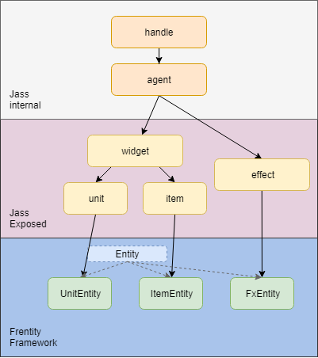

# Documentation

This is the documentation for the Frentity framework.
Frentity is a combination of a hierarchical entity system with wc3 lifecycle events and tool packages augmenting the entities.



All usually exposed handle subtypes (unit, item, effect) are wrapped into a Wurst class. All of these classes have the same `Entity` parent.
The goal is to build upon the warcraft 3 hierarchy and provide a more integrated and augmented workflow.

## The Entity

The abstract `Entity` class builds the foundation of every object that has a position on the map. Thus anything that fits that description *should* be an `Entity`.
By being an `Entity` the object will automatically be incorporated into the frentity eco system and be interoperable with all systems.

### Starting the loop

To have anything entity related actually work, you need to start the global entity loop that iterates over all active entities and updates them, every 0.03 seconds. Because it often isn't desired to have the loop active while initializing the map, you must invoke it manually, after you're done with your init.

```wurst
import EntityManagement

function initDone()
	startEntityLoop()
```

## Thinking Entity

The system expects you to be dealing with entities instead of jass handles most of the time. To be interoprable every such handle that will exist in your map, should have a related entity instance describing it. In cases where those handles are created programmatically, you should use entity constructors directly. When units enter the map through other means, e.g. building and training, you should listen to those events and assign an entity to the existing unit immediately.
To attach entities to units, the UnitIndexer is used, the unit's userdata remains untouched. Since items aren't indexed their entities are stored in the item's userdata, which therefore must remain untouched by the developer.

### Desining Entities

In order for each handle to have an attached entity, you need to subclass the provided entity classes found in `wurst/entity/Entity.wurst`. The core classes are all abstract and cannot be instanciated. To create texttag and effect entites, `TextTagEntity` and `FxEntity` are provided to use.

You need to decide when to create a new entity subclass and how to group handles. For example, units with complex spells and behaviours each warrant their own subclass. Heroes in a map usually are such a case. Creeps in a TD however, could share just one common `CreepEntity`, because they don't differ much in behaviour.

### Lifecycle functions

Once the entity loop has started, each entity's `.update()` function is called periodically every 0.03 seconds. You can override this function in your subclass to add custom code. Just make sure to call `super.update()` to keep the management working correctly. An example is a projectile subclass, which updates the effect's position in the `update` function and checks if it reached its target:

```wurst
public class Projectile extends FxEntity
	private real speed = 0
	protected real acc = 1.0
	protected real dist = 0
	private real maxDist = 0
	protected real lifespan = 0
		
	override function update()
		vel *= acc
		pos += vel
		setXY(pos)
		if startpos.distanceToSq(pos) > maxDist
			terminate()
```

The obvious problem that comes to mind with updating all entites in a single loop is performance. The more entites you have the longer the loop will take and most entites wouldn't even require the update, since they aren't doing anything right now, or ever, but still are an entity *as they are supposed to*.

The solution to this is that all entities which are considered inactive or sleeping, will be removed from the quickly iterated list, and added to a slowly iterated list. Whether or not an entity is affected by this is determined by the flag `sleeps` (default true), indicating that this entity should be marked inactive if it has no velocity.
Once a unit starts moving, it is added to the active list again. If you don't want an entity to ever fall asleep, e.g. a homing missile that may have very low velocity, but should still update after that, simply set `sleeps = false` in the constructor.
The lifecycle function for the inactive entites is `slowUpdate` and it is called every second. Override this function to add custom behaviour for when the entity is asleep. Remember to call super. Take a look at this example of a structure generating income every second:

```wurst
public class IncomeGoldmine extends UnitEntity
	var lvl = 1

	construct(unit constructed)
		super(constructed)

	override function slowUpdate()
		super.slowUpdate()
		let income = lvl * 2
		owner.addGold(income)
		createGoldBountyTextTag(actor, income, owner)

init
	EventListener.add(EVENT_PLAYER_UNIT_CONSTRUCT_FINISH) ->
		let structure = GetConstructedStructure()
		switch structure.getTypeId()
			case GOLDMINE_ID
				new IncomeGoldmine(structure)
```

As you can see this example also shows event listening. We listen to construct finish, and then assign our entity.

## FTexts

There are several issues with wc3's default texttag handling, like recycling the oldest texttag when the maximum of 100 is reached.
The `FText` package wraps texttags into FTexts provided via 
```
createFText(...)
createCenterFText(...)
```

`createCenterFText` attempts to center the texttag in default camera distance. You can combine FTexts with Entities by using `TextTagEntity.wurst` which allows dynamic movement and referencing.

With a simple snippet like this
```
doPeriodically(1/32) cb ->
	new ColorChangeTextEntity(t.getPos() - vec3(-64, 0, 0))
    
class ColorChangeTextEntity extends TextTagEntity
	var color = colorA(235,235,125,255)

	construct(vec3 pos)
		super(pos, vec3(GetRandomReal(-6,6), GetRandomReal(-6,6), GetRandomReal(8,14)), "Ðelta", GetRandomReal(4, 12), GetRandomReal(3, 5), color)

	override function update()
		super.update()
		if not done
			if not flying
				addVel(vec3(0,0,10))
				flying = true
			color = color.mix(colorA(226, 100, 4, 255), 0.025)
			ftext.tt.setColor(color)
```
You can easily create the following effect


Notice the color change, terrain-aware bouncing and the permanent *Item Shop* texttag staying even though the limit was surpassed. Of course you can fully customize this to your needs.

## Buffs

The `Buff.wurst` and related packages provide support for a lazily created list of normal or stacking buffs per entity. Creating dummy buffs via tornado has meanwhile been merged into the standard library, and thus should be the way for you to create Buffs.

Here is an example of a Buff based on ShieldBuff, that prevents a certain amount of damage on the target:

```
public buffTuple buffAbil = compiletime(createDummyBuffObject("Shield Kit", "This unit is protected by a shield that absorbs damage", 
			"BTNDivineIntervention.blp", Abilities.divineShieldTarget))
            
class ShieldKitBuff extends ShieldBuff
	vec3 pos

	construct(real amount)
		super(90., buffAbil, amount)
		Log.debug("ShieldKit created, dur: " + duration.toString() + " amount: " + amount.toString())

	override function apply(UnitEntity ue) 
		super.apply(ue)
		pos = ue.getPos()

	override function defenseModifier()
		super.defenseModifier()
		if blockAmount > 0
			new TextTagEntity(pos, vec3(GetRandomReal(-2, 2),0, GetRandomReal(8,12)), blockAmount.toInt().toString() , 10, 1., colorA(255, 204, 12, 255))

	override function onEnd()
		if duration == 90.
			new TextTagEntity(pos, vec3(0,0, GetRandomReal(9,12)), "Shield applied" , 13, 1.55, colorA(255, 204, 12, 255))
		else
			new TextTagEntity(pos, vec3(0,0, GetRandomReal(9,12)), "Shield collapsed" , 13, 1.55, colorA(255, 204, 12, 255))
```

We can now apply this buff to any unit for the desired effect. If the spell is applied to an already shielded unit, the block amount will be added to the existing shield.
```
new ShieldKitBuff(400.).apply(data)
```
